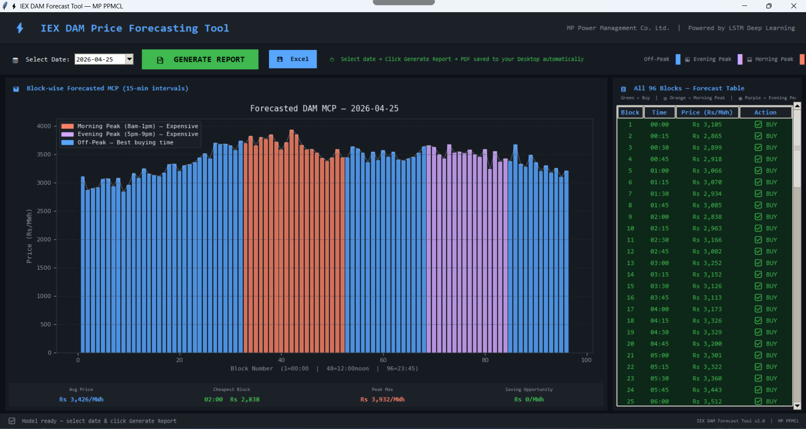

# ⚡ IEX DAM Price Forecasting Tool

> Block-wise MCP prediction using LSTM deep learning  
> Built for **MP Power Management Co. Ltd.**

---

## 📌 Problem Statement
MP PPMCL submits DAM bids daily at 10 AM for next-day power 
purchase. Without accurate price forecasting, DISCOM either 
overbids (wastes money) or underbids (faces shortage + RTM 
penalty costs).

## 💡 Solution
An end-to-end LSTM deep learning pipeline that predicts 
next-day IEX DAM Market Clearing Price (MCP) for all 96 
time blocks — deployed as a Tkinter desktop GUI with 
auto-generated manager PDF report.

---

## 🖥️ Screenshots


---

## 🏗️ Architecture
---

## 🛠️ Tech Stack
| Tool | Purpose |
|------|---------|
| Python | Core language |
| TensorFlow/Keras | LSTM model |
| Pandas & NumPy | Data processing |
| Matplotlib | Visualization |
| Tkinter | Desktop GUI |
| ReportLab | PDF generation |
| Scikit-learn | Preprocessing |

---

## 📊 Model Performance
| Metric | Target | 
|--------|--------|
| MAPE | < 10% |
| R² | > 0.85 |

---

## ⚙️ How to Run

```bash
git clone https://github.com/Duvvada-Naveen-Kumar/IEX-DAM-Price-Forecasting.git
cd IEX-DAM-Price-Forecasting
pip install -r requirements.txt

# Run pipeline
python notebooks/01_EDA_IEX_DAM.py
python notebooks/02_feature_engineering.py
python notebooks/03_lstm_model.py

# Launch GUI
python notebooks/04_gui_tkinter_manager.py
```

---

## 📋 Pipeline
| Script | Purpose |
|--------|---------|
| `01_EDA_IEX_DAM.py` | Exploratory data analysis |
| `02_feature_engineering.py` | Feature building |
| `03_lstm_model.py` | Train & evaluate LSTM |
| `04_gui_tkinter_manager.py` | Desktop GUI |
| `pdf_report.py` | Auto PDF report generator |

---

## 🏭 Domain Context
- **DISCOM:** MP Power Management Co. Ltd.
- **Market:** IEX Day-Ahead Market (DAM)
- **Target:** MCP (Market Clearing Price) in Rs/MWh
- **Blocks:** 96 per day (15-min intervals)
- **Use case:** DAM bid planning & cost optimization

---

## 👤 Author
**Duvvada Naveen Kumar**  
Data Analyst, MP Power Management Co. Ltd.  
[](https://linkedin.com/in/YOUR_LINKEDIN)
